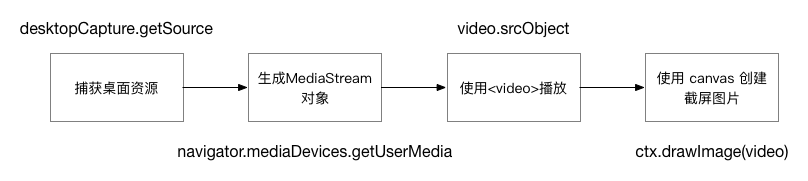
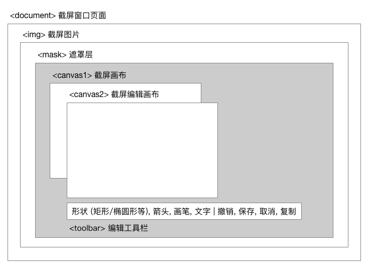
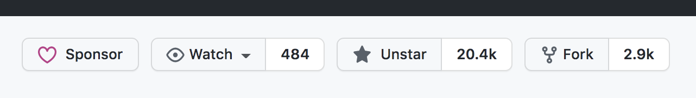
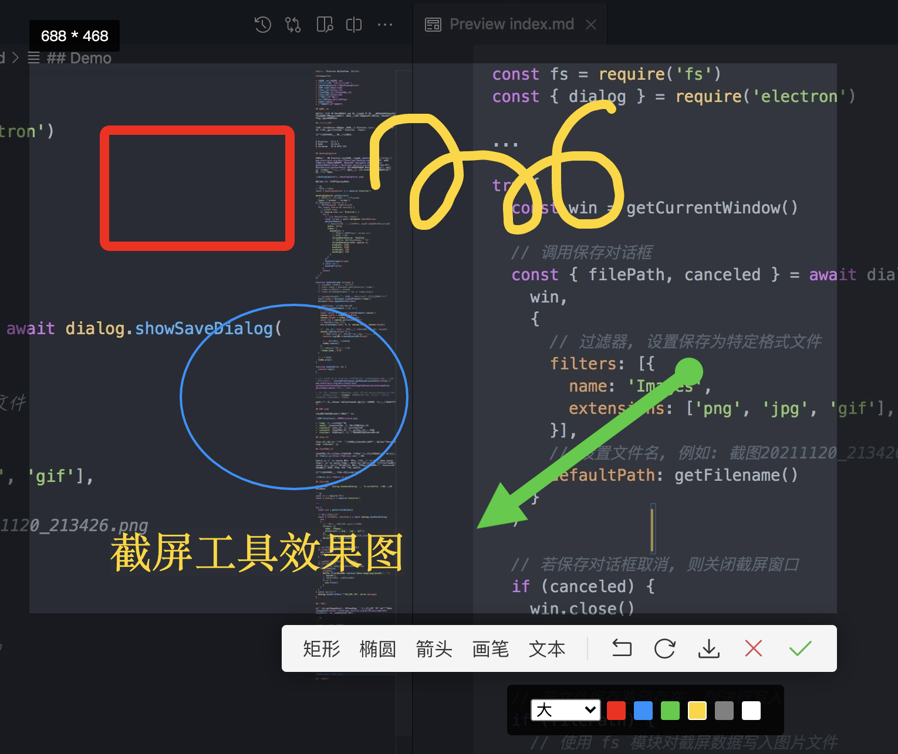

<h1>基于 Electron 的截屏工具开发</h1>

<h2>目录</h2>

- [需求背景](#需求背景)
- [浏览器兼容性](#浏览器兼容性)
- [desktopCapturer](#desktopcapturer)
- [DOM 结构](#dom-结构)
- [截屏画布](#截屏画布)
- [截屏编辑画布](#截屏编辑画布)
- [截屏保存](#截屏保存)
- [拾色器](#拾色器)
- [马赛克工具](#马赛克工具)
- [Dëmo](#dëmo)
- [总结](#总结)
- [参考资料](#参考资料)

## 需求背景

最近由于公司 IM 项目重心由 web 端转移到了 PC 端, 使得压了很久的屏幕截屏工具需求被重新提上了日程. 如何使用纯前端技术来实现截屏, 接下来便是可行性分析和技术探索阶段.

## 浏览器兼容性

本文所涉及的相关前端技术, 均运行在 Electron 环境中, 故不再讨论兼容性问题. 同时也假设读者已具备 Electron 开发经验.

截止本文编写日期, 运行环境如下:

```
# Electron   13.1.7
# Node       14.16.0
# Chromium   91.0.4472.124
```

## desktopCapturer

首先通过检索 Electron 官方文档, 找到了 [desktopCapturer](https://www.electronjs.org/docs/latest/api/desktop-capturer) API. 该接口的作用是捕获桌面资源, 然后结合 [navigator.mediaDevices.getUserMedia](https://developer.mozilla.org/en-US/docs/Web/API/MediaDevices/getUserMedia) 将桌面资源生成 MediaStream 对象, 提供给 `<video>` 标签进行播放, 最后使用 `ctx.drawImage()` 生成截屏图片. 流程图如下:



废话不多说, 直接分析官方代码:

```js
// 渲染进程代码
const { desktopCapturer } = require('electron')

desktopCapturer.getSources({ 
  // 资源类型: 应用窗口 和 计算机屏幕
  types: ['window', 'screen'] 
}).then(async sources => {
  // 遍历捕获到的所有窗口及屏幕
  for (const source of sources) {
    // 屏幕源 name
    if (source.name === 'Electron') {
      try {
        // 创建 MediaStream 实例对象
        const stream = await navigator.mediaDevices.getUserMedia({
          // 不录制音频: 出于安全限制, macOS 不允许直接录制音频
          audio: false,
          video: {
            mandatory: {
              // 这两个配置项应该是 chrome 专属
              // 来源: 桌面
              chromeMediaSource: 'desktop',
              // 来源id: 窗口或屏幕的唯一标识
              chromeMediaSourceId: source.id,
              minWidth: 1280,
              maxWidth: 1280,
              minHeight: 720,
              maxHeight: 720
            }
          }
        })
        handleStream(stream)
      } catch (e) {
        handleError(e)
      }
      return
    }
  }
})

function handleStream (stream) {
  // 官方代码 (下面三行, 已注释)
  // const video = document.querySelector('video')
  // video.srcObject = stream
  // video.onloadedmetadata = (e) => video.play()
  
  // 官方的示例到此为止, 下面进行适当扩展便于解释上面的流程图
  const video = document.createElement('video')
  document.body.appendChild(video)

  // 视频元信息加载完成回调函数
  video.onloadedmetadata = (e) => {
    // 创建画布
    const canvas = document.createElement('canvas')
    canvas.width = video.videoWidth
    canvas.height = video.videoHeight
    const ctx = canvas.getContext('2d')
    // 将视频绘制到画布上
    ctx.drawImage(video, 0, 0, canvas.width, canvas.height)

    // 转换画布为 blob (也可以使用 toDataURL 来转换为 base64)
    canvas.toBlob((blob) => {
      // 生成 blob url, 可直接放入  标签进行显示
      console.log(URL.createObjectURL(blob))

      // 转换完成后, 移除视频
      video.remove()
    }, 
    // 设置截屏图片格式和质量
    'image/jpeg', 0.9)
  }

  // 播放视频
  video.play()
}

function handleError (e) {
  console.log(e)
}
```

> 注1: macOS 10.15 Catalina 及更高版本下, 屏幕捕获需要用户进行授权, 授权状态可通过 [systemPreferences.getMediaAccessStatus](https://www.electronjs.org/docs/latest/api/system-preferences#systempreferencesgetmediaaccessstatusmediatype-windows-macos) 接口进行判断.

> 注2: 某些 Windows 系统不支持多屏幕, 会导致 source.display_id 始终为空, 此时不能够通过 `<video>` 来生成截屏图片, 只能通过 source.thumbnail.toDataURL() 来生成.

到此为止, 我们已经具备了截屏工具的基础能力, 下面就开始进行软件的详细设计.

## DOM 结构

截屏窗口的页面结构设计如下图所示:



- `` 用于显示整屏图片
- `<mask>` 半透明遮罩层, 用于凸显区域截屏画布
- `<canvas1>` 截屏画布, 用于绘制截屏选区
- `<canvas2>` 截屏编辑画布, 用于对截屏画布进行编辑
- `<toolbar>` 编辑工具栏, 用于放置各种编辑工具及操作项

## 截屏画布

截屏画布主要是通过计算鼠标在页面上按下与拖动的坐标, 将截屏图片相应区域绘制到 `<canvas1>` 上.

## 截屏编辑画布

截屏编辑画布复制截屏画布的内容, 同时具备在画布上编辑的能力, 该能力主要由 [Fabric.js](http://fabricjs.com/) 实现.

Fabric.js 是一个 canvas 操作开源库, 同时也是一个 SVG 转换到 canvas 解析器. 通过对 canvas 元素进行交互式对象模型抽象化, 能够非常便捷地在 canvas 上进行对象(形状)的创建和操作, 改变对象的各种属性, 以及其他更加强大的功能: 缓存, 分组, SVG 图片转换等等.

截止本文编写日期, 框架社区活跃度见下图:



## 截屏保存

截屏下载通过 `dialog.showSaveDialog` 和 `fs.writeFile` 实现, 主要代码如下: 

```js
const fs = require('fs')
const { dialog } = require('electron')

...

try {
  const win = getCurrentWindow()

  // 调用保存对话框
  const { filePath, canceled } = await dialog.showSaveDialog(
    win,
    {
      // 过滤器, 设置保存为特定格式文件
      filters: [{
        name: 'Images',
        extensions: ['png', 'jpg', 'gif'],
      }],
      // 设置文件名, 例如: 截图20211120_213426.png
      defaultPath: getFilename()
    }
  )

  // 若保存对话框取消, 则关闭截屏窗口
  if (canceled) {
    win.close()
    return
  }

  // 若文件保存路径存在, 则进行写入
  if (filePath) {
    // 使用 fs 模块对截屏数据写入图片文件
    fs.writeFile(
      filePath,
      Buffer.from(dataURL.replace('data:image/png;base64,', ''), 'base64'),
      // 写入完成后, 关闭截屏窗口
      () => {
        win.close()
      }
    )
  }
} catch (error) {
  dialog.showErrorBox('图片保存出错', error.message)
}
```

## 拾色器

通过 ctx.getImageData(), 可以获取到鼠标在画布上某一坐标的图形数据 [ImageData](https://developer.mozilla.org/en-US/docs/Web/API/ImageData), 从而获取该处的颜色值.

```js
...

// 通过鼠标事件, 获取坐标
const { clientX, clientY } = e
// 获取坐标处画布图像数据
const imageData = ctx.getImageData(
  clientX * scaleFactor,
  clientY * scaleFactor,
  1 * scaleFactor,
  1 * scaleFactor
)
// 通过 data 属性, 获取 RGBA 值
const [r, g, b, a] = imageData.data
```

## 马赛克工具

TODO: 使用马赛克/毛玻璃算法在截屏上绘制路径, 实现马赛克效果.

## Dëmo

至此, 基于 Electron 和前端技术的截屏工具基本实现. 效果图如下:



项目代码可自行参考 [Github 仓库](https://github.com/JSoon/ElectronScreenshot).

## 总结

总的来说, 通过 [desktopCapturer](https://www.electronjs.org/docs/latest/api/desktop-capturer) 和 [Facric.js](http://fabricjs.com/), 降低了前端开发截屏和编辑功能的难度, 使得开发者可以更专注于交互性开发. 

但是, 由于国内互联网的限制, 以及[原生 Node 模块](https://www.electronjs.org/docs/latest/tutorial/using-native-node-modules)区别于 Electron 运行环境, 在将截屏功能集成到 Electron 应用时, 不可避免又会遇到 [node-canvas](https://github.com/Automattic/node-canvas) 的编译问题. 关于打包 node-canvas, 可参考[《如何在 mac OS 和 Windows 下编译 node-canvas 到 Electron 应用》]().

## 参考资料

[从零开始用 electron 手撸一个截屏工具](https://juejin.cn/post/6844903687706378247)

[Electron 截图踩坑和优化集合](https://juejin.cn/post/6844903697705598983)

[基于 Electron 实现屏幕取色和截屏](https://juejin.cn/post/6982124234180919327)

[使用 vue + electron 实现一个桌面截图工具](https://zhuanlan.zhihu.com/p/121075555)