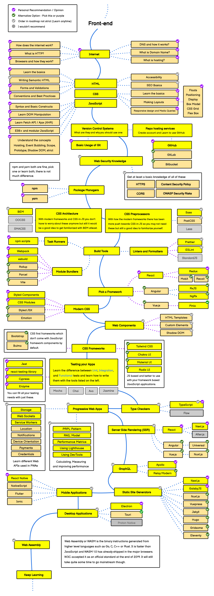

# Front-end Roadmap For 刘兆函

## Contents

- [Front-end Roadmap For 刘兆函](#front-end-roadmap-for-刘兆函)
  - [Contents](#contents)
  - [🔍 前端学习路径图](#-前端学习路径图)
  - [Internet](#internet)
  - [HTML](#html)
  - [CSS](#css)
  - [JavaScript](#javascript)

## 🔍 前端学习路径图

## Internet

The Internet is a global network of computers connected to each other which communicate through a standardized set of **protocols**.

- [How does the internet work?](http://web.stanford.edu/class/msande91si/www-spr04/readings/week1/InternetWhitepaper.htm)
- [互联网协议入门（一）](http://www.ruanyifeng.com/blog/2012/05/internet_protocol_suite_part_i.html)
- [互联网协议入门（二）](https://www.ruanyifeng.com/blog/2012/06/internet_protocol_suite_part_ii.html)
- [HTTP 协议入门](https://www.ruanyifeng.com/blog/2016/08/http.html)
- [How browser works](https://developer.mozilla.org/en-US/docs/Web/Performance/How_browsers_work)
- [浏览器工作原理](https://juejin.cn/post/7047462821352701966)

## HTML

The HyperText Markup Language or HTML is the standard markup language for documents designed to be displayed in a web browser. It can be assisted by technologies such as Cascading Style Sheets (CSS) and scripting languages such as JavaScript.

- [HTML 教程](https://www.runoob.com/html/html-tutorial.html)
- [使用惯例和最佳实践](https://github.com/hail2u/html-best-practices/blob/main/README.zh-CN.md)

## CSS

Cascading Style Sheets (CSS) is a style sheet language used for describing the presentation of a document written in a markup language such as HTML or XML (including XML dialects such as SVG, MathML or XHTML). CSS is a cornerstone technology of the World Wide Web, alongside HTML and JavaScript. CSS describes how elements should be rendered on screen, on paper, in speech, or on other media.

- [CSS 教程](https://www.runoob.com/css/css-tutorial.html)
- [盒模型](https://developer.mozilla.org/en-US/docs/Learn/CSS/Building_blocks/The_box_model)
- [flexbox 弹性盒子，真正意义上的布局样式](https://www.jianshu.com/p/ce5d23ec13aa)
- [一张图读懂 flexbox](https://css-tricks.com/wp-content/uploads/2022/02/css-flexbox-poster.png)
- [Flexbox Froggy - 弹性盒子呱呱呱, 你学"废"了吗?](https://flexboxfroggy.com/)
- [Grid Garden - 一起来种胡萝卜](https://cssgridgarden.com/)
- [媒体查询完整指南](https://css-tricks.com/a-complete-guide-to-css-media-queries/)

## JavaScript

JavaScript (`/ˈdʒɑːvəskrɪpt/`), often abbreviated as JS, is a [programming language](https://en.wikipedia.org/wiki/Programming_language) that is one of the core technologies of the [World Wide Web](https://en.wikipedia.org/wiki/World_Wide_Web), alongside HTML and CSS.

- [现代 JavaScript 教程](https://zh.javascript.info/)（以最新的 JavaScript 标准为基准。通过简单但足够详细的内容，讲解从基础到高阶的 JavaScript 相关知识，并提供在线编辑预览功能。）