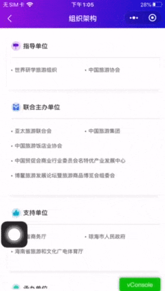

<h1>微信小程序 - WeUI 自定义顶部导航</h1>

<h2>目录</h2>

- [为什么需要使用自定义顶部导航](#为什么需要使用自定义顶部导航)
- [自定义导航组件原理](#自定义导航组件原理)
- [需要注意的问题](#需要注意的问题)

## 为什么需要使用自定义顶部导航

微信小程序的原生顶部导航一共支持四种配置项:

1. navigationBarBackgroundColor 导航栏背景颜色，如 #000000
2. navigationBarTextStyle 导航栏标题颜色，仅支持 black / white
3. navigationBarTitleText 导航栏标题文字内容
4. navigationStyle 导航栏样式，仅支持以下值：
   - default 默认样式
   - custom 自定义导航栏，只保留右上角胶囊按钮

> 自定义导航仅支持7.0.0及以上版本, 低版本需要自行进行原生配置.

由于小程序在界面设计上的多样性, 原生的配置很可能不满足我们的需求, 如渐变背景色, 标题文字颜色, loading效果等等. 为此, 通过引入微信官方的WeUI扩展组件, 来实现自定义导航.

## 自定义导航组件原理

WeUI自定义导航通过小程序自定义组件能力和小程序API实现, 并未涉及其他相关技术. 通过源码可以很清晰地掌握其实现逻辑, 大致如下:

**组件属性**

定义了一系列组件可接收的属性及缺省值.

```js
/**
  * 组件的属性列表
  */
properties: {
  extClass: {
    type: String,
    value: ''
  },
  title: {
    type: String,
    value: ''
  },
  background: {
    type: String,
    value: ''
  },
  color: {
    type: String,
    value: ''
  },
  back: {
    type: Boolean,
    value: true
  },
  loading: {
    type: Boolean,
    value: false
  },
  animated: {
    // 显示隐藏的时候opacity动画效果
    type: Boolean,
    value: true
  },
  show: {
    // 显示隐藏导航，隐藏的时候navigation-bar的高度占位还在
    type: Boolean,
    value: true,
    observer: '_showChange'
  },
  // back为true的时候，返回的页面深度
  delta: {
    type: Number,
    value: 1
  }
},
```

**组件初始化**

获取系统状态栏高度及菜单按钮位置属性, 设置导航行内样式.

```js
attached() {
  const isSupport = !!wx.getMenuButtonBoundingClientRect;
  const rect = wx.getMenuButtonBoundingClientRect ? wx.getMenuButtonBoundingClientRect() : null;
  wx.getSystemInfo({
    success: res => {
      const ios = !!(res.system.toLowerCase().search('ios') + 1);
      this.setData({
        ios,
        statusBarHeight: res.statusBarHeight,
        innerWidth: isSupport ? `width:${rect.left}px` : '',
        innerPaddingRight: isSupport ? `padding-right:${res.windowWidth - rect.left}px` : '',
        leftWidth: isSupport ? `width:${res.windowWidth - rect.left}px` : ''
      });
    }
  });
},
```

**组件方法**

定义了显示/隐藏, 以及返回两个方法. 其中返回方法调用的是`wx.navigateBack`接口, `delta`默认为1, 即导航路径栈栈顶的地址.

```js
/**
  * 组件的方法列表
  */
methods: {
  _showChange(show) {
    const animated = this.data.animated;
    let displayStyle = '';

    if (animated) {
      displayStyle = `opacity: ${show ? '1' : '0'};-webkit-transition:opacity 0.5s;transition:opacity 0.5s;`;
    } else {
      displayStyle = `display: ${show ? '' : 'none'}`;
    }

    this.setData({
      displayStyle
    });
  },

  back() {
    const data = this.data;

    if (data.delta) {
      wx.navigateBack({
        delta: data.delta
      });
    }

    this.triggerEvent('back', {
      delta: data.delta
    }, {});
  }

}
```

**组件视图结构**

组件视图就是常规的`wxml`文档, 我们可以任意对其进行个性化`wxss`样式定制.

## 需要注意的问题

当自定义导航运行在Android和iOS两大平台上时, 其操作行为并没有差异. 但是, 当我们为自定义导航设置样式时, 需要注意一个问题: **导航背景样式**.

例如, 我们需要为导航条增加一个渐变色背景:

```css
/* 导航根节点 */
.weui-navigation-bar {
  background-image: linear-gradient(90deg, rgba(144, 18, 219, 1), rgba(14, 18, 204, 1)) !important;
}
```

**Android**


**iOS**



通过上例我们发现, 在iOS下, 整个页面(可以理解为`<page>`节点)连同顶部导航一起, 发生了滚动位移.

很奇怪, 不是吗? 那么, 为什么会这样? 这便是由于两大手机操作系统的差异造成的:

> iOS下, 滚动距离溢出屏幕时, 会出现弹性动画效果, 从而造成页面节点发生相应的位移. Android系统则不会(至少是大部分).

仔细观察可以发现, 导航的内容部分并未跟随页面进行滚动, 仅仅是背景色随之发生了位移. 检查源码发现, `.weui-navigation-bar__inner`才是固定布局的元素:

```css
.weui-navigation-bar__inner {
  position: fixed;
  top: 0;
  left: 0;
  z-index: 5001;
  height: var(--height);
  padding-right: var(--right);
  width: calc(100% - var(--right));
}
```

因为之前的背景色被添加到了外层元素`.weui-navigation-bar`上, 由于iOS系统弹性动效的特性, 所以背景色也发生了位移. 所以我们只需要将背景色添加到`.weui-navigation-bar__inner`上即可:

```css
.weui-navigation-bar .weui-navigation-bar__inner {
  background-image: linear-gradient(90deg, rgba(144, 18, 219, 1), rgba(14, 18, 204, 1)) !important;
}
```
