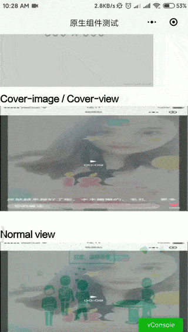
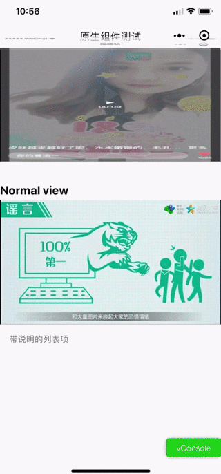
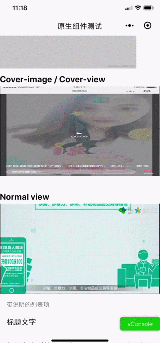

<h1>微信小程序 - 原生组件采坑记录</h1>

<h2>目录</h2>

- [测试环境说明](#测试环境说明)
- [关于原生组件调试](#关于原生组件调试)
- [坑点记录](#坑点记录)
  - [1. 原生组件层级](#1-原生组件层级)
  - [2. 原生组件滚动性](#2-原生组件滚动性)
  - [3. 原生组件在固定高度下定位不跟随滚动](#3-原生组件在固定高度下定位不跟随滚动)
  - [4. 原生组件在固定高度下与非原生组件之间发生层级错乱](#4-原生组件在固定高度下与非原生组件之间发生层级错乱)
  - [待更新...](#待更新)
- [参考资料](#参考资料)

## 测试环境说明

由于本文旨在定位及揭示bug以供参考, 故测试环境覆盖机型仅限于开发者所用.

- 小程序基础库版本 2.11.1
- iPhone X / iOS 13.6 / 微信 7.0.14
- 小米5s plus / Android 8.0.0 / 微信 7.0.15

## 关于原生组件调试

在日常开发中, 我们通常会使用微信小程序开发者工具来进行代码预览. 一般情况下, 预览结果都与真机测试无太大差异, 但是, 一旦当页面上引入了[原生组件](https://developers.weixin.qq.com/miniprogram/dev/component/native-component.html)后, 则请 ***务必及时*** 在真机上进行测试. 原因如下: 

> 在工具上，原生组件是用web组件模拟的，因此很多情况并不能很好的还原真机的表现，建议开发者在使用到原生组件时尽量在真机上进行调试。

## 坑点记录

### 1. 原生组件层级

原生组件的层级始终高于非原生组件, 目前支持同层渲染的原生组件有`video`, `map`, `live-player`, `live-pusher`, `canvas(2d)`. 换句话说, 若你使用了其他类型的原生组件, 则无法控制它们与非原生组件的层级关系. 比如说, 原生组件会遮挡自定义导航组件. 如下图:

上图中, 自定义导航组件被`cover-view`实现的封面图遮挡.

> 建议: 避免使用不支持同层渲染的组件, 如`cover-view`, `cover-image`等等. 另外, `cover-image`目前也不支持`mode`属性, 图片比例无法做到自适应.

### 2. 原生组件滚动性

在Android系统下, 原生组件覆盖区域无法进行页面滚动交互, 即会导致页面无法进行滚动操作. 在iOS下则不会出现这种情况. 如下图(Android): 

上图中, 当在`cover-view`实现的封面图区域进行滚屏交互时, 页面无法发生滚动(Android下).

> 建议: 避免使用不支持同层渲染的组件, 如`cover-view`, `cover-image`等等.

### 3. 原生组件在固定高度下定位不跟随滚动

当原生组件所在外层的视图容器(如`view`, `scroll-view`)高度固定时, 部分原生组件的位置不会随着视图容器的滚动而发生位移. 如下图(iOS):

上图所示为`video`中嵌套了`cover-view`实现的封面图, 在滚屏时, `cover-view`不会跟随屏幕实时滚动.

另外, 同样的情况在Andoid下, ***可能`cover-view`根本不会发生位置刷新***.

> 建议: 避免在可滚屏, 且固定高度的交互区域使用不支持同层渲染的组件, 如`cover-view`, `cover-image`等等.

### 4. 原生组件在固定高度下与非原生组件之间发生层级错乱

当原生组件所在外层的视图容器(如`view`, `scroll-view`)高度固定时, 与相同位置不同层级的非原生组件之间层叠关系会发生错乱. 在Android下则不会出现这种情况. 如下图(iOS): 

上图中, 由`view`实现的封面图在滚屏时, 会发生不明原因的显示/隐藏.

> 建议: 避免在可滚屏, 且固定高度的交互区域, 对原生和非原生组件进行层叠布局.

### 待更新...

## 参考资料

[微信官方文档-小程序-原生组件说明](https://developers.weixin.qq.com/miniprogram/dev/component/native-component.html)

[微信官方文档-小程序-cover-view](https://developers.weixin.qq.com/miniprogram/dev/component/cover-view.html)

[微信小程序 video组件 不随页面滚动](https://www.cnblogs.com/i-douya/p/9145630.html)