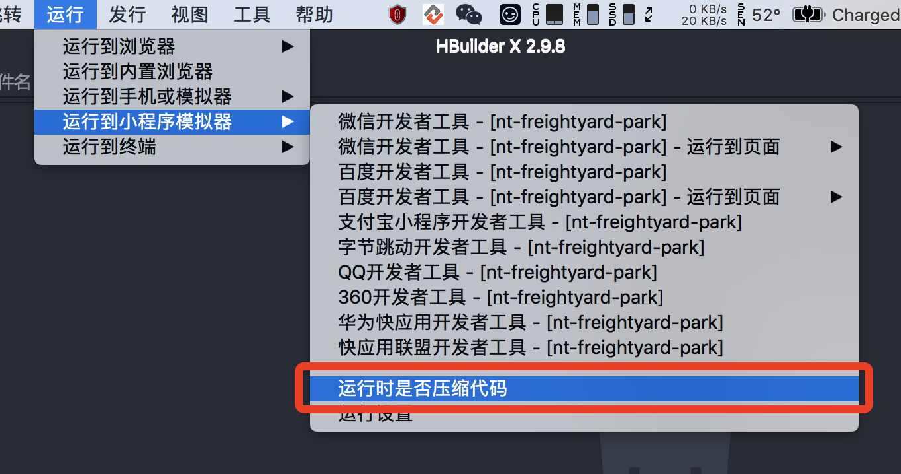
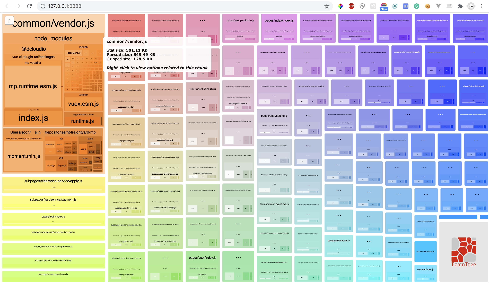
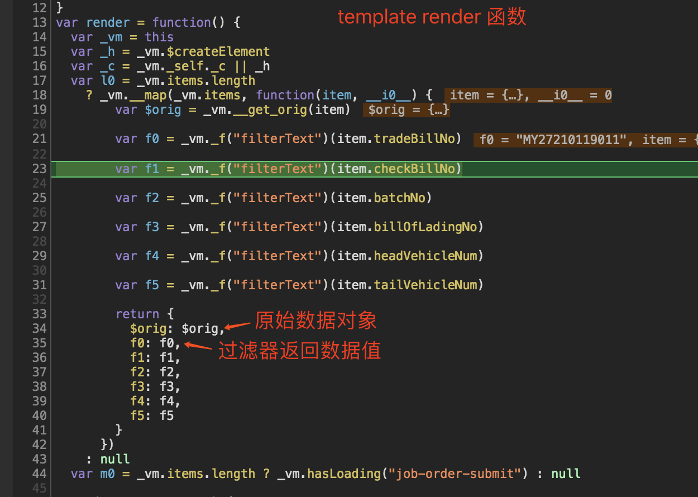
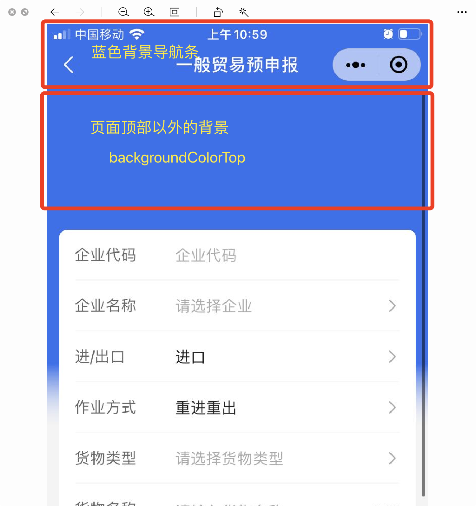

<h1>微信小程序 & uni-app 问题集合以及解决方案</h1>

<h2>目录</h2>

- [问题集合](#问题集合)
  - [像素单位](#像素单位)
  - [图标](#图标)
  - [[原生] 阻止事件冒泡](#原生-阻止事件冒泡)
  - [[uni] 阻止事件冒泡](#uni-阻止事件冒泡)
  - [原生组件导致的兼容问题](#原生组件导致的兼容问题)
  - [自定义导航 fixed 导致 iOS 下滚动时背景随页面移位](#自定义导航-fixed-导致-ios-下滚动时背景随页面移位)
  - [[uni] 样式穿透](#uni-样式穿透)
  - [[uni] 主包大小超限制导致真机预览失败或无法上传](#uni-主包大小超限制导致真机预览失败或无法上传)
  - [[uni] 多环境运行 & 发布](#uni-多环境运行--发布)
  - [[uni] 页面间通讯](#uni-页面间通讯)
  - [[uni] filter, 对象数据, onChange事件](#uni-filter-对象数据-onchange事件)
  - [showLoading & showToast & hideLoading](#showloading--showtoast--hideloading)
  - [[原生] backgroundColorTop & backgroundColorBottom](#原生-backgroundcolortop--backgroundcolorbottom)
  - [待更新...](#待更新)

## 问题集合

### 像素单位

原生开发全部使用 `rpx`.

uni-app 开发在 `<style>` 中使用 `upx`, 在 `<template>` 和 `<script>` 中使用 `rpx`.

### 图标

单色图标使用字体图标.

多彩图标使用 `svg` 文件或者样式表中内嵌 `data:image/svg+xml;base64`, 但后者不具备良好的可维护性.

### [原生] 阻止事件冒泡

使用 `catchtap`. 

> 除 bind 外，也可以用 catch 来绑定事件。与 bind 不同， catch 会阻止事件向上冒泡。

https://developers.weixin.qq.com/miniprogram/dev/framework/view/wxml/event.html

### [uni] 阻止事件冒泡

优先使用 `click.stop`, 失效时尝试使用 `tap.stop` (某些情况下, 例如, 第三方组件可能对 `click` 事件进行过重写). 

### 原生组件导致的兼容问题

[微信小程序 - 原生组件采坑记录](http://jsoon.fun/JiaHua-Front-End-Coding-Guide/views/blog-miniprogram-native-component/blog-miniprogram-native-component.html)

### 自定义导航 fixed 导致 iOS 下滚动时背景随页面移位

在使用自定义导航 fixed 布局时, 需将背景设置在 fixed 元素上, 否则, 由于 iOS 存在弹性交互效果, 设置在非 fixed 元素上(如父元素节点)会造成背景随 Page 移位的情况. 此类兼容问题适用于所有 fixed 布局元素.

[微信小程序 - WeUI 自定义顶部导航](http://jsoon.fun/JiaHua-Front-End-Coding-Guide/views/blog-miniprogram-custom-navigation/blog-miniprogram-custom-navigation.html)

### [uni] 样式穿透

uni-app 使用 Vue.js 进行开发, 所以在样式穿透时仍然使用 `::v-deep` 修饰符. 需注意的是, 因为在运行时本质上代码还是原生小程序, 所以在多层级的嵌套组件中, 仍需使用小程序的 `options.styleIsolation` 配置项. 

```js
export default {  
  options: { styleIsolation: 'shared' },
  // ...
}
```

具体规则如下:

- 页面样式穿透页面组件, 无需配置 `options.styleIsolation`

```js
// Router Page
<template>
  <view class="page">
    <ParentComponent />
  </view>
</template>
<style lang="scss">
.page::v-deep {
  .parent-component {
    color: red;
  }
}
</style>

// ParentComponent
<template>
  <view class="parent-component">
  </view>
</template>
```

- 父组件样式穿透子组件, 须给父组件配置 `options.styleIsolation`

```js
// Router Page
<template>
  <view class="page">
    <ParentComponent />
  </view>
</template>

// ParentComponent
<template>
  <view class="parent-component">
    <ChildComponent />
  </view>
</template>
<script>
export default {
  options: {
    styleIsolation: 'shared'
  }
}
</script>
<style lang="scss">
.parent-component::v-deep {
  .child-component {
    color: green;
  }
}
</style>

// ChildComponent
<template>
  <view class="child-component">
  </view>
</template>
```

[自定义组件-组件模板和样式](https://developers.weixin.qq.com/miniprogram/dev/framework/custom-component/wxml-wxss.html#组件样式隔离)

https://ask.dcloud.net.cn/question/73797

### [uni] 主包大小超限制导致真机预览失败或无法上传

**基础配置**
```json
// manifest.json
{
  // 微信开发者工具 - 项目配置文件配置
  "mp-weixin": {
    "setting": {
        "urlCheck": false,
        "es6": true,
        "enhance": false,
        "postcss": true,
        "minified": true
    },
    "usingComponents": true,
    // 打开分包优化
    "optimization": {
        "subPackages": true
    },
    // 其他忽略打包项
    "packOptions": {
        "ignore": [
          // ...
        ]
    }
},
}
```

**常规解决方案**

勾选运行时是否压缩代码.



此方法简单粗暴, 在每一次代码编译时会启动压缩功能, 会导致中低性能的设备龟速运行, 慎选, 不推荐.

**终极解决方案**

安装 [webpack-bundle-analyzer](https://www.npmjs.com/package/webpack-bundle-analyzer), 分析模块组成, 从根本上减小包体积.

```bash
npm install webpack-bundle-analyzer -D
```

```js
// vue.config.js
module.exports = {
  chainWebpack: config => {
    // 包分析插件, 默认开启, 热更新, 有助于打包代码分析
    config
      .plugin('webpack-bundle-analyzer')
      .use(require('webpack-bundle-analyzer').BundleAnalyzerPlugin)
  }
}
```

经上面的配置, 项目运行后默认会打开 http://127.0.0.1:8888/, 该地址即为可视化分析界面, 如下图所示:



**注意事项**

一般情况下, 即使运行代码未经压缩, 主包的大小也应在合法的范围内, 这个限制应是经过微信官方从代码质量和设备性能等各方面考虑而得出的一个合理限制. 

如果在开发时, 小程序由于主包大小超过限制而无法预览及上传, 主要应从以下几个方面进行排查:

1. 当引用 `lodash` 等模块时, 引入方式是否正确

```js
// 错误的引入方式
// 会将整个lodash打入主包, 体积会增加400kb左右
import { isNil } from 'lodash'

// 正确的引入方式
// 仅会打入核心库和isNil
import _isNil from 'lodash/isNil'
```

2. 引入的模块是否包含国际化文件, 例如 `momentjs`

```js
// 错误的引入方式
// 会打入所有国际化文件, 整个locale包体积约为500kb
import moment from 'moment'

// 正确的引入方式
// 引入核心库
import moment from 'moment/min/moment.min'
// 按需引入单个locale包
import 'moment/locale/zh-cn'
moment.locale('zh-cn')
```

3. 静态资源文件大小, 如图片, 字体等资源大小是否过大

4. 其他情况可根据 `webpack-bundle-analyzer` 的可视化界面自行分析

### [uni] 多环境运行 & 发布

默认情况下, 在HBuilderX 中，点击“运行”编译出来的代码是开发环境，点击“发行”编译出来的代码是生产环境. 但是, 在实际工作中, 很可能不止存在两种开发环境.

若希望自定义开发环境变量, 需在 `package.json` 中进行配置.

```json
{
  // ...
  "uni-app": {
    "scripts": {
      "build:staging": {
        "title": "测试环境",
        "env": {
          "UNI_PLATFORM": "mp-weixin",
          // 勿使用 NODE_ENV 进行定义, HBuilderX 在编译时会对 NODE_ENV 进行覆盖
          "APP_ENV": "staging"
        }
      },
      "build:prod": {
        "title": "生产环境",
        "env": {
          "UNI_PLATFORM": "mp-weixin",
          "APP_ENV": "production"
        }
      }
    }
  }
}
```

[uni-app 运行环境判断](https://uniapp.dcloud.io/frame?id=%e8%bf%90%e8%a1%8c%e7%8e%af%e5%a2%83%e5%88%a4%e6%96%ad)

[package.json扩展配置](https://uniapp.dcloud.io/collocation/package)

https://www.jianshu.com/p/e8401b08f4b5

### [uni] 页面间通讯

页面间通讯通常使用两种方式: 

1. 全局事件 emit

```js
// page A
// 事件发布
uni.$emit('update', { msg: '页面更新' })

// page B
// 事件订阅
const callback = ({ msg } = {}) => {
  console.log(msg) // '页面更新'
}
uni.$on('update', callback)
// 取消事件订阅
uni.$off('update', callback)
```

值得注意的是, 若全局事件在单个组件中订阅, 同时该组件在同一页面上被多次引入, 会造成由同一页面同一组件多次渲染, 导致 emit 事件重复注册的 issue. 所以需要在事件发布的组件中加入 `eventStamp(举例命名)` 事件戳属性, 从而保证全局事件在同一时间点的唯一性.

2. 页面间事件 eventChannel

```js
// page A
// 事件订阅
uni.navigateTo({
  events: {
    update ({ msg } = {}) {
      console.log(msg) // '页面更新'
    }
  }
})

// page B
// 事件发布
const eventChannel = this.getOpenerEventChannel()
eventChannel.emit('update', { msg: '页面更新' })
```

两种方式的主要区别在于:

- 页面级别只能在跳转页面间进行监听,
- 全局级别则不受页面限制.

可根据应用场景酌情选择.

https://uniapp.dcloud.io/collocation/frame/communication

https://uniapp.dcloud.io/api/router?id=navigateto

https://developers.weixin.qq.com/miniprogram/dev/api/route/wx.navigateTo.html

### [uni] filter, 对象数据, onChange事件

[vue-cli-plugin-uni](https://www.npmjs.com/package/@dcloudio/vue-cli-plugin-uni) 会将 filter 后的数据单独返回, 原始对象会被存储在一个名为 `$orig` 的对象中, 原始对象的数据结构会被改变, 通过调试源码, 可以发现类似代码:



上面源码中可以发现, `_vm.items` (原始数据)被 map 为了一个新的数组, 每一个 `item` 数据项被封装到了一个新的对象中:

```js
// new item
{
  $orig: $orig,
  f0: f0,
  f1: f1,
  ...,
  fn: fn
}
```

这样就会导致一个问题, 在 `onChange` 事件(不仅限于该事件)句柄中若对 `item` 有引用, 那么此时若要访问原始数据对象, 需从 `item.$orig` 中获取.

### showLoading & showToast & hideLoading

`showLoading` 和 `showToast` 在底层调用的都是系统级别的 toast, 由于手机操作系统限制, 同时只能够存在唯一的 toast, 所以当调用 `hideLoading` 时, 会关闭掉所有的 toast.

> 由于 [运行环境](https://developers.weixin.qq.com/miniprogram/dev/framework/runtime/env.html) 的差异, 在开发者工具中, 不存在该限制.

为避免 `hideLoading` 关闭所有的 toast, 可以通过队列缓存来解决. 以下是 uni-app 的实现代码, 供参考:

```js
// vuex store

// 关闭所有toast和loading界面反馈
const hideLoading = (state) => {
  // 当toast队列为空, 且loading队列也为空时, 才调用hideLoading
  if (!state.toasts.length && !state.loadings.length) {
    uni.hideLoading()
  }
}

export default {
  namespaced: true,
  state: {
    // showToast和showLoading都是系统级别的toast(同一个), hideLoading会同时将其关闭, 故这里需要手动进行队列缓存进行管理
    loadings: [],
    toasts: []
  },
  mutations: {
    ADD_LOADING (state, loading = 'loading') {
      state.loadings.push(loading)
    },
    REMOVE_LOADING (state) {
      state.loadings.pop()
      hideLoading(state)
    },
    ADD_TOAST (state, toast = 'toast') {
      state.toasts.push(toast)
    },
    REMOVE_TOAST (state) {
      state.toasts.pop()
      hideLoading(state)
    }
  }
}
```

[wx.hideLoading 会把 wx.showToast提示框关掉](https://developers.weixin.qq.com/community/develop/doc/0000ea4401cce8c9381b8477d51400)

https://developers.weixin.qq.com/miniprogram/dev/api/ui/interaction/wx.showToast.html

### [原生] backgroundColorTop & backgroundColorBottom

仅 iOS 支持, 当顶部导航背景非 `#FFFFFF` 时, 用于设置顶部/底部弹性交互页面以外的背景色, 避免出现白色, 造成较大的色块视觉差. 若不设置则默认为纯白色.



### 待更新...